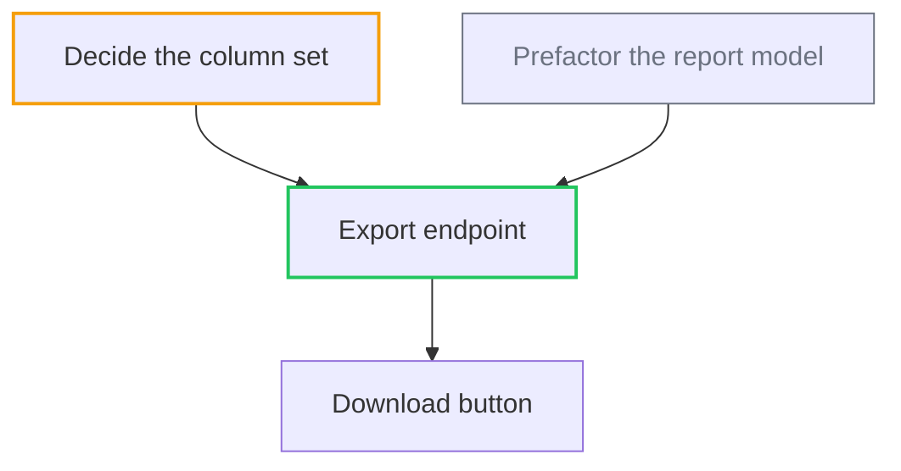

# Chart templates and the create-then-wire mechanic

Reached from `SKILL.md` step 4. Terms are defined in [`../../GLOSSARY.md`](../../GLOSSARY.md).
Premise fields follow [`../../EVIDENCE-AUTHORITY.md`](../../EVIDENCE-AUTHORITY.md).

## Map body (issue labelled `dag:map`)

The whole chart at low resolution — the index, loaded once per session. The map's nodes are its
sub-issues, found with `gh api repos/<owner>/<repo>/issues/<map-number>/sub_issues`. The map only gists
and links.

```markdown
## Destination

<what reaching the end of this chart looks like — the spec, feature, or change it builds to. One or two lines.>

## Scope edge

<what this expedition deliberately does not include.>

## Premises

<!-- Include every premise that unlocks this map. Full premise records may live on the parent Atlas or
     planning issue; keep exact refs and the chain walkable. -->

### Premise P-1
- **Claim:** <intent or fact>
- **Class:** <authority class>
- **Source/ref:** <exact user answer, path@commit, or versioned URL + observed date>
- **Status:** active
- **Derived artifacts:** <map and node titles/links>

## Notes

<domain; standing preferences for this expedition.>

**Skills** — build: `<what a teammate consults while building>` · review: `<the skill, agent, or bot
that reviews its PR>`. Both are copied verbatim into every dispatch brief, so a teammate never guesses
what this expedition builds and reviews with. The suite delegates *who* does the work; it only owns what
they are told.

## Proof profile

<!-- What this repo can prove with. Written once; every node's proof contract is drawn from it.
     List only the tiers that genuinely exist here — an absent tier is stated as absent, never faked. -->

| tier | exists here? | how it is reached |
|---|---|---|
| 1 mechanical | yes | `<the repo's test/typecheck/build command>` |
| 2 integrated | yes/no | `<command>` |
| 3 live | yes/no | `<how this repo runs its code, and how the run is driven and observed>` |
| 4 readback | yes/no | `<the durable store and how it is queried>` |
| 5 observed | yes/no | `<the event/error collector and how it is queried, or "none">` |

**Tier 3 reachable from a branch?** yes | no. Yes — proof is a **merge gate** signal, gathered on the PR
before the node merges. No — name the shared environment only the merged head reaches, and proof runs
straight after the merge. This is the whole of the proof-stage decision; no node declares its own.

Receipts are committed to `docs/receipts/<node>-<date>/`.

## Run profile

<!-- How this expedition is run. Defaults are fine; state them so a fresh window runs it the same way. -->

- **concurrency** — `<max nodes in flight at once>`
- **models** — coder `<model>` · reviewer `<model>`
- **autonomy** — autonomous | supervised

## Standing instruction — keep this map fresh

This map is the chart. It is read at the start of every session and it must never be stale.

Whenever a node changes state — it closes, it is sent back, a de-fog node resolves, a new node is
graduated — regenerate this map before doing anything else, in the same turn, as part of finishing the
work rather than as a follow-up:

1. **Redraw the DAG.** Recompute which nodes are on the frontier — open, with every blocker closed — and
   restyle: `start` for frontier (green outline, recompute every time; closing one node usually promotes
   two or three), `defog` for open de-fog nodes (amber), `done` for closed (grey). Never delete a closed
   node from the graph — the shape of what has been walked is the point.
2. **Update that node's line in the index** — mark it done, or correct its readiness.
3. **Say what moved onto the frontier** in the closing comment on the node, by title, so the next session
   doesn't have to recompute it.
4. **Re-check premise status.** Operational frontier and evidence authority are separate: an open node
   whose premise is contested, invalid or superseded is stopped even when native blockers are closed.
   Run the invalidation receipt before redrawing a replacement route.

Recompute the frontier from the tracker, never from memory of this file. A map whose graph disagrees with
the tracker is a bug, and the fix is never to trust the graph.

## The DAG



## Nodes

<!-- one line per node: title (linked) — readiness — one-line gist. Mark closed ones done. -->

- [<node title>](link) — clear — <gist>
- [<node title>](link) — needs-prototype (spike: [<spike title>](link)) — <gist>
- [<node title>](link) — **done** — <gist>

## Not yet specified

<!-- only if escalated to fog-of-war: the un-ticketable regions, graduated into nodes as upstream de-fog resolves. -->
```

The two clauses that make the freshness instruction bind rather than aspire: **"in the same turn, as part
of finishing the work"** — a refresh deferred to a follow-up step is a refresh that does not happen; and
**"recompute from the tracker, never from memory"** — `dependencies/blocked_by` is the truth and the
diagram is only a rendering of it.

A map that goes stale is worse than no map, because people trust it.

## Node body (child issue of the map)

```markdown
## What to build

The end-to-end behaviour this node makes work, from the user's perspective — not a layer-by-layer list.

## Acceptance criteria

- [ ] Criterion 1
- [ ] Criterion 2

## Premises

**Derived from:** P-1, P-2

<!-- Every listed premise is active at the exact ref recorded on the map/Atlas. A contested, invalid or
     superseded premise makes this node non-dispatchable regardless of native blockers. -->

## Proof

<!-- Written NOW, before any code — never left for the implementing agent to invent.
     Surface: what this node touches (UI / backend / API / CLI / messaging), which fixes the evidence form. -->

**Surface:** <ui | backend | api | cli | messaging>

| tier | what proves this node | evidence form |
|---|---|---|
| 1 mechanical | <the checks that must pass> | command + result |
| 3 live | <the real thing happening> | <screenshot + video / durable delta / transcript> |
| 4 readback | <the record that must exist afterwards> | <query + exact ids> |

<!-- Include only the tiers in the map's proof profile. If a tier in the profile does not apply to
     this node, keep the row and write "N/A — <reason>"; silent omission reads as coverage. -->

**Nonce:** <where it enters and the path it must travel — e.g. "the reference typed into the submit
form, read back on the confirmation screen and in the orders row". The value is minted at run time,
not written here: anything written here is in the repo before the run and can never be shown absent.>

## Readiness

clear | needs-grilling | needs-research | needs-prototype — one line on the de-fog node if any.

## Blocked by

The blocking nodes (build edges + any de-fog node), or "None — on the frontier".
```

Avoid speculative implementation file lists and code snippets — they go stale. Immutable provenance is
required: premise source paths carry the exact commit/ref that made them authoritative. A
prototype/spike that produced a decision-encoding snippet (state machine, reducer, schema, type shape)
may inline the decision-rich bit, scoped to its question and exact spike commit; it is not current canon
without current adoption.

De-fog node bodies (grilling / research / prototype) hold just the question or spike goal; the matching
`/dag:grill`, `/dag:research`, `/dag:prototype` skill drives them.

## Create, then wire — two passes

Issues must exist before they can reference each other, so create everything first, wire second. Both
relationships are REST endpoints that take an issue's **database id**, never its `#number` — so capture
the id alongside the number as you go.

**Pass 1 — create and parent.** Create the map issue, then create each node and attach it to the map as
a sub-issue. The map already exists by then, so each node is parented as it is created.

`gh issue create` prints the new issue's **URL**, not its number — so capture and parse it rather than
assuming a number you never bound:

```bash
R=<owner>/<repo>
MAP=$(gh issue create -R $R --title "map: <destination>" --label dag:map --body-file map.md \
      | grep -oE '[0-9]+$')

# repeat per node; a de-fog node carries its readiness label, a build node carries none
N=$(gh issue create -R $R --title "<node title>" --body-file node-NN.md \
    --label dag:needs-research | grep -oE '[0-9]+$')
NID=$(gh api repos/$R/issues/$N --jq .id)                     # the database id, not the number
gh api -X POST repos/$R/issues/$MAP/sub_issues -F sub_issue_id=$NID
```

**Pass 2 — wire.** Now that every node has an id, add the blocking edges — for each node, link the nodes
that block it (build edges and its de-fog node).

```bash
BLOCKER_ID=$(gh api repos/$R/issues/<blocker-number> --jq .id)
gh api -X POST repos/$R/issues/<blocked-number>/dependencies/blocked_by -F issue_id=$BLOCKER_ID
```

Wiring sorts nodes into the **frontier** (no open blockers) and the blocked. Read both back to confirm
what you wired — **always paginated**, because both endpoints default to 30 per page and a truncated
read looks exactly like a smaller DAG:

```bash
gh api --paginate repos/$R/issues/$MAP/sub_issues --jq '.[] | {number, title}'
gh api --paginate repos/$R/issues/<n>/dependencies/blocked_by --jq '.[] | {number, state}'
```

*Done when:* every node is a sub-issue of the map, every build and de-fog edge is a real dependency
link, and both readbacks return exactly what you wired.
